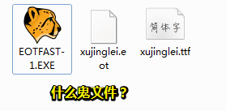

# 在网页中使用自定义字体

## ①@font-face是什么？

**➹：**[@font-face - CSS：层叠样式表 | MDN](https://developer.mozilla.org/zh-CN/docs/Web/CSS/@font-face)

## ②.ttf、.eot、还有个豹子头是啥文件？

## ③本地明明没有徐静蕾字体，为啥能起效果？

## ④为啥要自定义字体？

