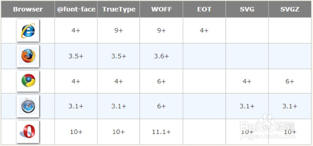
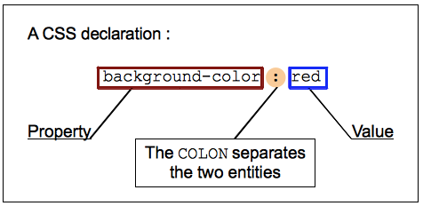
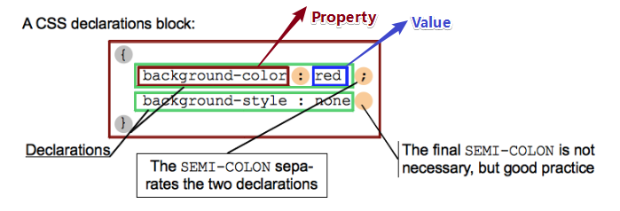
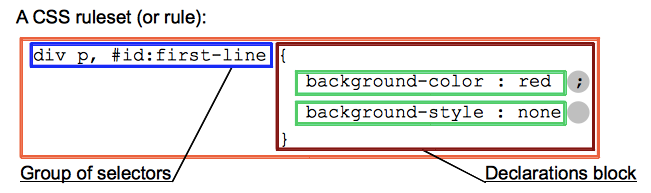
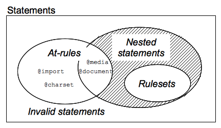
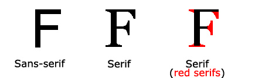

# 在网页中使用自定义字体

## ①@font-face是什么？

**➹：**[@font-face - CSS：层叠样式表 | MDN](https://developer.mozilla.org/zh-CN/docs/Web/CSS/@font-face)

这是在CSS3中新增的@规则，用于描述将要下载的外部的字体，为什么要这样做呢？因为这种开发人员自备字体方式，可以消除对用户电脑字体的依赖。

那么我们如何使用它呢？

 `@font-face` 不仅可以放在在CSS的最顶层, 也可以放在 @规则 的 [条件规则组](https://developer.mozilla.org/zh-CN/docs/CSS/At-rule#Conditional_Group_Rules) 中。

关于它常用的font-family和src属性，**✎：**

1. 所指定的字体名字将会被用于font或font-family属性( `i.e. font-family: <family-name>;` )
2. 远程字体文件位置的URL或者用户计算机上的字体名称， 可以使用local语法通过名称指定用户的本地计算机上的字体( `i.e. src: local('Arial');` )。 如果找不到该字体，将会尝试其他来源，直到找到它。也就是说src属性可以有多个以 逗号`，`分割的值咯！

## ②.ttf、.eot、还有个豹子头是啥文件？


首先，先来说一下，为什么会存在有这么几种字体格式类型的文件？

有这么一种情况，我们要求在网页中应该使用字体类型，然而有些浏览却不支持，那么怎么办呢？选择同一种类型的字体而不同的规格啊！

看看这个表你就知道了，**✎：**



总之，最好还是使用`.woff`这种字体格式，毕竟WOFF（Web开发字体格式）是一种专门为了Web而设计的字体格式标准……而且字体文件被压缩，以便于网络传输。

**➹：**[ttf,eot,woff,svg,字体格式介绍及使用方法 - 心存善念 - 博客园](http://www.cnblogs.com/xcsn/p/6019048.html)

**➹：**[字体格式类型(.eot/.otf/.woff/.svg) - 轩悦 - 博客园](https://www.cnblogs.com/jiayuexuan/p/7235861.html)

推荐一个tff转woff等的工具，**✎：**

**➹：**[Create Your Own @font-face Kits » Font Squirrel](https://www.fontsquirrel.com/tools/webfont-generator)

至于那个豹子头文件，既然是 `.exe`后缀的，那么显然它是个可执行程序吧！那么它的功能是怎样的呢？

它可以把`.ttf`字体格式转化为`.eot`的，总之它就是个字体转换工具哈！当然这是为了兼容IE这坑货，不过目前看来应该不需要了！

**➹：**[2段代码实现在所有浏览器下显示特殊字体（附字体转换工具） - 记录那些逝去的青春 - CSDN博客](https://blog.csdn.net/xqd890608/article/details/13511837)

**➹：**[★计算机系统是如何显示一个字符的？ - 知乎](https://www.zhihu.com/question/24340504/answer/29927340)

## ③关于CSS的语法？

**➹：**[语法 - CSS：层叠样式表 | MDN](https://developer.mozilla.org/zh-CN/docs/Web/CSS/Syntax)

> CSS的基本目标是让浏览器以指定的**特性**去绘制页面元素，比如颜色，定位，装饰。
>
> CSS的语法反映了这个目标，由下面两个部分构建：
>
> - 属性（ **property）**是一个标识符，用可读的名称来表示其**特性**。如color、border……
> - 值（**value）**则描述了**浏览器引擎如何处理该特性**。**每个属性都包含一个有效值的集合**，它有正式的语法和语义定义，被浏览器引擎实现。 

这就是像是用标签来标记文本等信息，相当于是用标签来表示信息的标记，而CSS则是用属性来表示元素的特性！

- CSS声明，**✎：**

  

- CSS声明块，**✎：**

  

- CSS规则，**✎：**

  

  > 规则是样式表的主体，通常样式表会包括大量的规则列表

- CSS语句，**✎：**

  为了让样式表有其它的一些信息，如字符集，导入其它的外部样式表，字体等，而不是充斥着大量的规则的列表，为此引入了专门的语句，用于表示规则列表之外的信息……

  那么其语法是怎样的呢？

  语句以非空格的字符开头，以第一个反花括号或分号结束，**✎：**

  

  ```css
  @import 'custom.css';
  
  @media (min-width: 801px) {
    body {
      margin: 0 auto;
      width: 800px;
    }
  }
  ```

  **➹：**[CSS 语法 - 学习 Web 开发 | MDN](https://developer.mozilla.org/zh-CN/docs/Learn/CSS/Introduction_to_CSS/Syntax#CSS_%E8%AF%AD%E5%8F%A5%EF%BC%88CSS_statements%EF%BC%89)

## ④font-family?

在CSS2中，该属性只能使用两种字体！

那么这两种字体是什么呢？

1. 通用字体系列——拥有相似外观的字体系统组合、如Serif、Sans-Serif、Monospace、……
2. 特定字体系列——具体的字体系列，即本地字体，如Times、Courier、……

根据font-family的特点，**✎：**

> font-family 属性应该设置几个字体名称作为一种"后备"机制，如果浏览器不支持第一种字体，他将尝试下一种字体。

所以，你在设置字体的时候，需要一个备胎，即设置的最后一个字体必须是通用字体系列！

关于Serif和Sans-Serif的区别，**✎：**

前者是有衬线字体，而后者则是没有衬线的！而所谓的衬线指的是在字的笔画开始、结束的地方有额外的装饰，而且笔画的粗细会有所不同。



注意： 在计算机屏幕上，sans-serif字体被认为是比serif字体容易阅读，所以你的备胎一般选为sans-serif……

ps：如果字体系列的名称超过一个字，它必须用引号，如Font Family："宋体"。多个字体系列是用一个逗号分隔指明，**✎：**

```css
p { font-family: "Times New Roman", Times, serif; }
```

不过相较于CSS2这个规则，CSS3新出的@font-face这一新规则，会使得网页更具多样性。毕竟可以使用自定义字体哈！而且这一规则的应用在国外的很多网站里很常见，为什么这么说呢？

这是相较于中国而言的，**✎：**

1. 国外网速快，英文只有26个字母以及其它字符，为此字体文件占用空间小，所以网站使用自定义字体，对于请求该字体，然后响应回来的速度并无明显影响
2. 中文字符有很多，这也就意味着字体文件很大，而且网速也不太行，虽然自定义字体用着美观，但这也意味着拖慢网页的响应，所以你一般看到的中文网站都少有存在大面积自定义的现象，即只是偶尔在一个旮旯里有一小块区域是自定义字体的

如果未来网速飞快，那么@font-face终将有用武之地！

还有关于svg格式的字体，**✎：**

> 有时网站也会使用svg格式的字体，图片字体经常被应用在使用字体中的图标以取代图片。也就说所谓的图标字体！讲真，这个真是极其常见哈！如所谓的图标库……

**➹：**[font-family - CSS：层叠样式表 | MDN](https://developer.mozilla.org/zh-CN/docs/Web/CSS/font-family)

**➹：**[CSS Fonts(字体) | 菜鸟教程](http://www.runoob.com/css/css-font.html)

**➹：**[网页字体Serif和Sans-serif的区别及浏览器字体的设置 – 深冬](https://angeltime.cc/archives/728.html)

**➹：**[图片上是何种英文字体，另求识别字体的好方法？ - 知乎](https://www.zhihu.com/question/21096278)

**➹：**[如何制作 svg 格式的 图标字体? - 知乎](https://www.zhihu.com/question/29054543)

**➹：**[Iconfont-阿里巴巴矢量图标库](http://iconfont.cn/)

