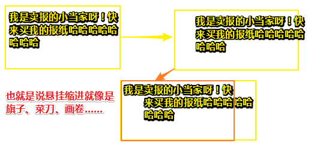
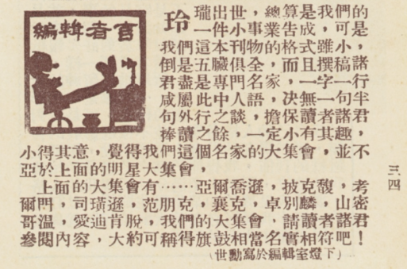

# 文本缩进和首字符下沉


## ①悬挂缩进为何意？

悬挂缩进：在这种段落格式中，段落的首行文本不加改变，而除首行以外的文本缩进一定的距离。 悬挂缩进常用于[项目符号和编号](https://baike.baidu.com/item/%E9%A1%B9%E7%9B%AE%E7%AC%A6%E5%8F%B7%E5%92%8C%E7%BC%96%E5%8F%B7/7715867)列表。悬挂缩进是相对于[首行缩进](https://baike.baidu.com/item/%E9%A6%96%E8%A1%8C%E7%BC%A9%E8%BF%9B/7337431)而言的。

就像是下面这样吗？，**✎：**

> 我喜欢吃的水果有，**✎：**
>
> 1. 橘子
> 2. 苹果
> 3. 葡萄

**➹：**[悬挂缩进_百度百科](https://baike.baidu.com/item/%E6%82%AC%E6%8C%82%E7%BC%A9%E8%BF%9B/7337480?fr=aladdin)

感觉demo里所说的悬挂缩进没有体现哈，总不能说是第一个字的个头最高，导致同处一行的文字都矮一截，为此营造出一种垂直方向上缩进的视觉效果？

我再次搜寻答案，**✎：**

> [悬挂缩进](https://www.baidu.com/s?wd=%E6%82%AC%E6%8C%82%E7%BC%A9%E8%BF%9B&tn=SE_PcZhidaonwhc_ngpagmjz&rsv_dl=gh_pc_zhidao)是指整个段落左侧一齐往右移动n个字符。首行是在[悬挂缩进](https://www.baidu.com/s?wd=%E6%82%AC%E6%8C%82%E7%BC%A9%E8%BF%9B&tn=SE_PcZhidaonwhc_ngpagmjz&rsv_dl=gh_pc_zhidao)n的基础上再加上[首行缩进](https://www.baidu.com/s?wd=%E9%A6%96%E8%A1%8C%E7%BC%A9%E8%BF%9B&tn=SE_PcZhidaonwhc_ngpagmjz&rsv_dl=gh_pc_zhidao)量。n为设置值

**➹：**[WORD中什么是悬挂缩进?_百度知道](https://zhidao.baidu.com/question/445518809.html?qbl=relate_question_4)

**➹：**[WORD:详细解释首行缩进和悬挂缩进有何不同?怎么用?_百度知道](https://zhidao.baidu.com/question/26514290.html?qbl=relate_question_0)

**➹：**[WORD中，什么是首行缩进，什么是悬挂缩进？_百度知道](https://zhidao.baidu.com/question/10967836.html)

这也就是说像下面这样吗？**✎：**



所以我能说有序列表和无序列表就是一种悬挂缩进的格式吗？

## ②文本缩进？

段落的首行最左边看看是否需要有空格插入哈！

**➹：**[文本缩进是什么意思。_百度知道](https://zhidao.baidu.com/question/550140394.html)

## ③首字下沉？



**➹：**[中文排版中有必要使用「首字下沉」吗？使用时需要注意什么问题？ - 知乎](https://www.zhihu.com/question/19644477)

**➹：**[CSS深入理解vertical-align和line-height的基友关系 « 张鑫旭-鑫空间-鑫生活](https://www.zhangxinxu.com/wordpress/2015/08/css-deep-understand-vertical-align-and-line-height/comment-page-2/)

## ④:first-letter和::first-letter？

为什么会多了一个冒号？难道就这样从伪类升级到了伪元素？

因为在CSS2中并不是说所有单冒号的都是伪类，而现在伪元素采用双冒号前缀, 并且伪类仍然采用单冒号前缀.

当然，如果考虑浏览器兼容性的话, `:first-letter` 是一个更有效的选择; 否则, `::first-letter` 更受欢迎.

```css
/* 使每段开头的第一个字母变红变大 */

p::first-letter {  /* 使用:first来兼容IE8- */
  color: red; 
  font-size: 130%; 
}
```

需要注意的是，**✎：**

> 首行只在 [block-container box](https://developer.mozilla.org/en/CSS/Visual_formatting_model#Block-level_elements_and_block_boxes)内部才有意义, 因此 `::first-letter` 伪元素 只在[`display`](https://developer.mozilla.org/zh-CN/docs/Web/CSS/display)属性值为block, `inline-block`, `table-cell`, `list-item` 或者 `table-caption`的元素上才起作用. 其他情况下, `::first-letter` 毫无意义.

这就像是[`::before`](https://developer.mozilla.org/zh-CN/docs/Web/CSS/::before) 伪元素 和 [`content`](https://developer.mozilla.org/zh-CN/docs/Web/CSS/content) 属性结合起来有可能会在元素前面注入一些文本。如此，`::first-letter` 将会匹配到content文本的首字母。

不过，找到元素的首字符并不总是很容易识别哈！

所以，first-letter到底是什么呢？

[CSS](https://developer.mozilla.org/en/CSS) [伪元素](https://developer.mozilla.org/en/CSS/Pseudo-elements) `::first-letter`会选中某 [block-level element](https://developer.mozilla.org/en-US/docs/Web/CSS/Visual_formatting_model#Block-level_elements_and_block_boxes)（块级元素）第一行的第一个字母，并且文字所处的行之前没有其他内容（如图片和内联的表格） 。

```css
/* Selects the first letter of a <p> */
p::first-letter {
  font-size: 130%;
}
```

**➹：**[::first-letter (:first-letter) - CSS：层叠样式表 | MDN](https://developer.mozilla.org/zh-CN/docs/Web/CSS/::first-letter)

那关于伪元素，还有哪些呢？

> 除了::before 和::after，CSS 的伪元素还有::first-line、::first-letter 和::selection 这三个，这三个相对来说就简单得多，用法也较为单纯

当然，这是常见的哈，可不止这5个伪元素！不过我们了解这5个就可以了！

**➹：**[CSS 伪元素( first-line、first-letter、selection) - OXXO.STUDIO](https://www.oxxostudio.tw/articles/201706/pseudo-element-4.html)

## ⑤px和em？

像素 (px) 是一种绝对单位（**absolute units**），那么何为绝对呢？所谓绝对指的是，**✎：**

> 无论其他相关的设置怎么变化，像素指定的值是不会变化的。

也就是说，这是不分空间和时间的！或者说这是不依赖设备的？

真得不依赖设备吗？

比如说电脑上的像素概念适用于手机端的像素概念吗？

是时候，看一波维基百科，看看像素到底为何意了……

> 像素，为影像显示的基本单位，译自[英文](https://www.wikiwand.com/zh-hans/%E8%8B%B1%E6%96%87)“**pixel**”，**pix**是英语单词picture的常用简写，加上英语单词“元素”**el**ement，就得到**pixel**，故“像素”表示“画像元素”之意，有时亦被称为**pel**（**p**icture **el**ement）。每个这样的讯息元素不是一个[点](https://www.wikiwand.com/zh-hans/%E7%82%B9)或者一个方块，而是一个抽象的[取样](https://www.wikiwand.com/zh-hans/%E5%8F%96%E6%A8%A3)。

没有想到一个名字，居然有那么多内涵哈！在我看来所谓基本单位也就是说这是个约定俗成的单位，即大家在日常中都得使用的一个单位咯！总不能在日常中说1000ms吧，除非你是在站在计算机的角度来说这个时间还差不多！

我不知道px是否还能再次细分，你要知道单位（计量单位）的意思是用于人类衡量一个数额的方法，当然，单位的给定皆属人为，总之单位（计量单位）的出现是为了以方便人们在沟通某一[量](https://www.wikiwand.com/zh-hans/%E9%87%8F_(%E7%89%A9%E7%90%86))（如长和短、重或轻等……）时有共通的概念。

而在色彩中有这么一个概念，**✎：**

> **三原色**指色彩中不能再分解的三种基本颜色，我们通常说的**三原色**，即品红、黄、青。总之，这是一种基本色。

也就是三原色是不能在分解的，而像素同样也是如此。

我摘录几点关于像素的综述，**✎：**

1. 一个像素通常被视为影像的最小的完整取样。这个定义和上下文很相关。
2. 用来表示一幅影像的像素越多，结果更接近原始的影像。

总之像素是一个抽象的概念！

**➹：**[原色 - Wikiwand](https://www.wikiwand.com/zh-cn/%E5%8E%9F%E8%89%B2)

**➹：**[国际单位制基本单位 - Wikiwand](https://www.wikiwand.com/zh-cn/%E5%9B%BD%E9%99%85%E5%8D%95%E4%BD%8D%E5%88%B6%E5%9F%BA%E6%9C%AC%E5%8D%95%E4%BD%8D)

**➹：**[像素 - Wikiwand](https://www.wikiwand.com/zh-hans/%E5%83%8F%E7%B4%A0)

**➹：**[人眼睛的分辨率相当于数码相机的多少像素啊_百度知道](https://zhidao.baidu.com/question/587091848.html?qbl=relate_question_6)

**➹：**[CSS的值和单位 - 学习 Web 开发 | MDN](https://developer.mozilla.org/zh-CN/docs/Learn/CSS/Introduction_to_CSS/Values_and_units)

**➹：**[知识点整理 - 前端涉及的各种像素概念以及 viewport 汇总 - Joe’s Blog](https://hijiangtao.github.io/2017/07/09/Device-Viewport-and-Pixel-Introduction/)


